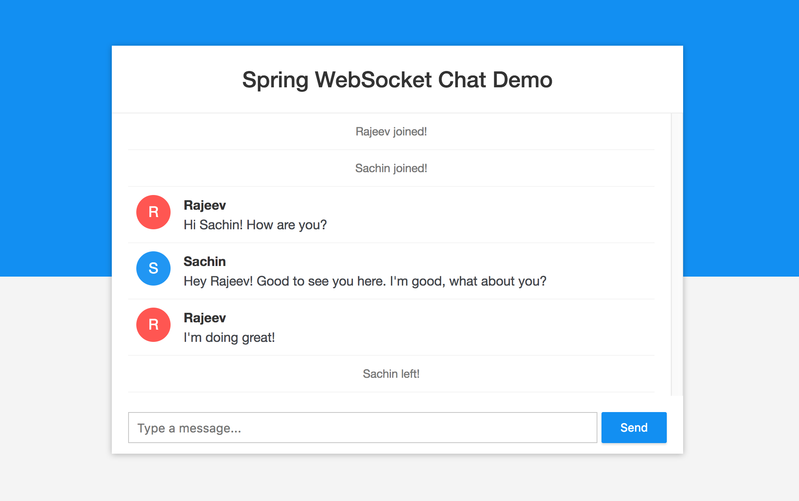

# ChatSphere 💬

👉 **Live Demo:** [chatsphere-production-749f.up.railway.app](https://chatsphere-production-749f.up.railway.app/)

ChatSphere is a real-time, multi-user web chat application built using **Spring Boot**, **WebSockets**, **STOMP**, and **SockJS**. It supports dual authentication flows (traditional credentials registry and Google OAuth2 Single Sign-On), dynamic active user tracking, connection resolution, and chat history recovery.



---

## 🌟 Key Features

* **Real-time Messaging:** Fast and bidirectional message routing using WebSocket over STOMP protocol.
* **Dual Login Flows:**
  * **Credential Login:** Custom secure user registration and login (`/api/register`, `/api/login`) with SHA-256 password hashing.
  * **Google OAuth2 SSO:** Quick login via Google accounts utilizing custom authorization request resolvers.
* **Chat History Recovery:** Retains previous messages in-memory so new or reconnected clients can fetch historical logs on startup.
* **Active User Registry:** Dynamically manages active websocket connections, ensuring usernames are unique using an automated name-suffixing strategy.
* **System Event Notifications:** Automated join/leave system message notifications broadcast to all connected chatters.
* **Production Ready Containerization:** Equipped with custom `Dockerfile` and Kubernetes configurations (`k8s-deployment.yaml`).

---

## 🛠️ Technology Stack

* **Backend Engine:** Java 11+, Spring Boot 2.x/3.x, Spring Web, Spring Security, Spring WebSocket
* **Frontend Interface:** HTML5, CSS3, JavaScript, SockJS Client, STOMP.js
* **Build System:** Maven 3.x
* **Deployment:** Docker, Kubernetes

---

## 📋 API & WebSocket Registry

### REST API Endpoints

| Method | Endpoint | Description | Authentication |
| :--- | :--- | :--- | :--- |
| `POST` | `/api/register` | Register a new user with username and password | Public |
| `POST` | `/api/login` | Authenticate username/password credentials | Public |
| `POST` | `/api/logout` | Terminate session and clear security context | Session Cookies |
| `GET` | `/api/me` | Fetch active user credentials and authentication type | Session Cookies / OAuth2 |
| `GET` | `/api/history` | Retrieve historical chat logs | Public |

### WebSocket Endpoints

| Type | Destination | Description |
| :--- | :--- | :--- |
| **Connection Endpoint** | `/ws` | STOMP handshake endpoint |
| **Send Message** | `/app/chat.sendMessage` | Send a message to the public channel |
| **Add User** | `/app/chat.addUser` | Announce user presence on connection |
| **Subscription Broker** | `/topic/public` | Public channel for receiving messages and join/leave events |

---

## ⚙️ Configuration Setup

For Google OAuth2 login to work properly, you need to configure your Google API credentials.

1. Go to the [Google Cloud Console](https://console.cloud.google.com/).
2. Create a project and set up OAuth 2.0 Credentials.
3. Configure these environment variables or place them in `src/main/resources/application.properties`:

```properties
spring.security.oauth2.client.registration.google.client-id=${GOOGLE_CLIENT_ID}
spring.security.oauth2.client.registration.google.client-secret=${GOOGLE_CLIENT_SECRET}
```

*Note: For local environments, you can define them in an `application-local.properties` file.*

---

## 🚀 Running Locally

### 1. Requirements
* **Java:** JDK 11 or higher
* **Maven:** Maven 3.x.x

### 2. Build & Package
Build the executable JAR file using Maven:
```bash
mvn package
```

### 3. Run the Application
Run the packaged JAR:
```bash
java -jar target/websocket-demo-0.0.1-SNAPSHOT.jar
```

Or run it directly using the Spring Boot plugin:
```bash
mvn spring-boot:run
```

The server will start on port `8080`. Access the client at [http://localhost:8080](http://localhost:8080).

---

## 🐳 Containerization & Orchestration

### Docker Setup
Build your Docker image locally:
```bash
docker build -t chatsphere:0.0.1-SNAPSHOT .
```

Run the container:
```bash
docker run -p 8080:8080 chatsphere:0.0.1-SNAPSHOT
```

### Kubernetes Deployment
Deploy the service using the provided manifest:
```bash
kubectl apply -f k8s-deployment.yaml
```
This spawns a `chat-server` pod and exposes it as a `NodePort` service mapping port `8080`.
